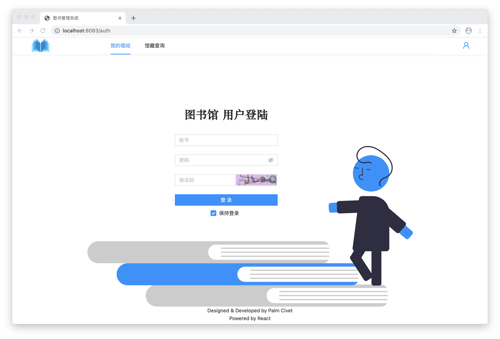
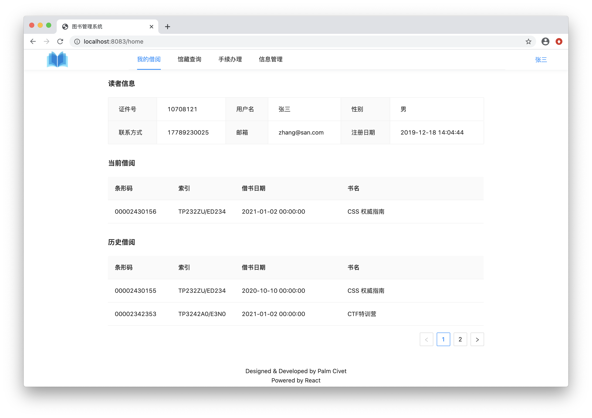
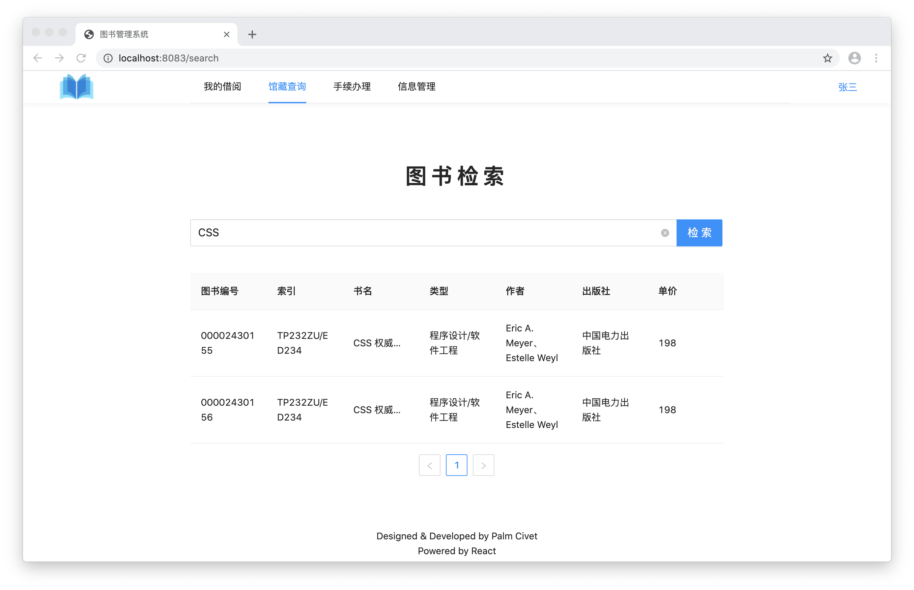
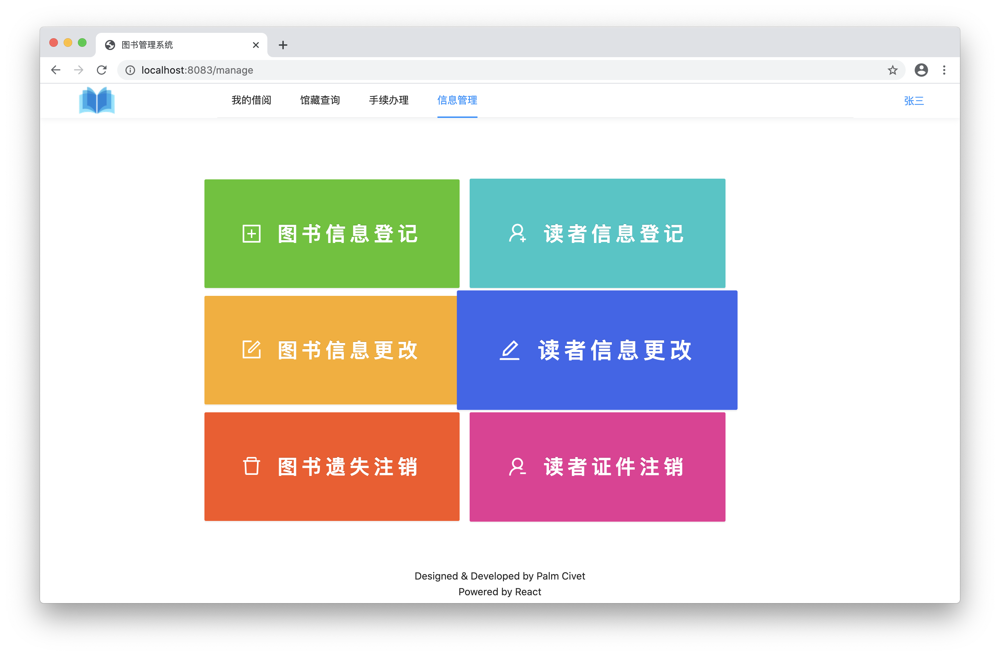
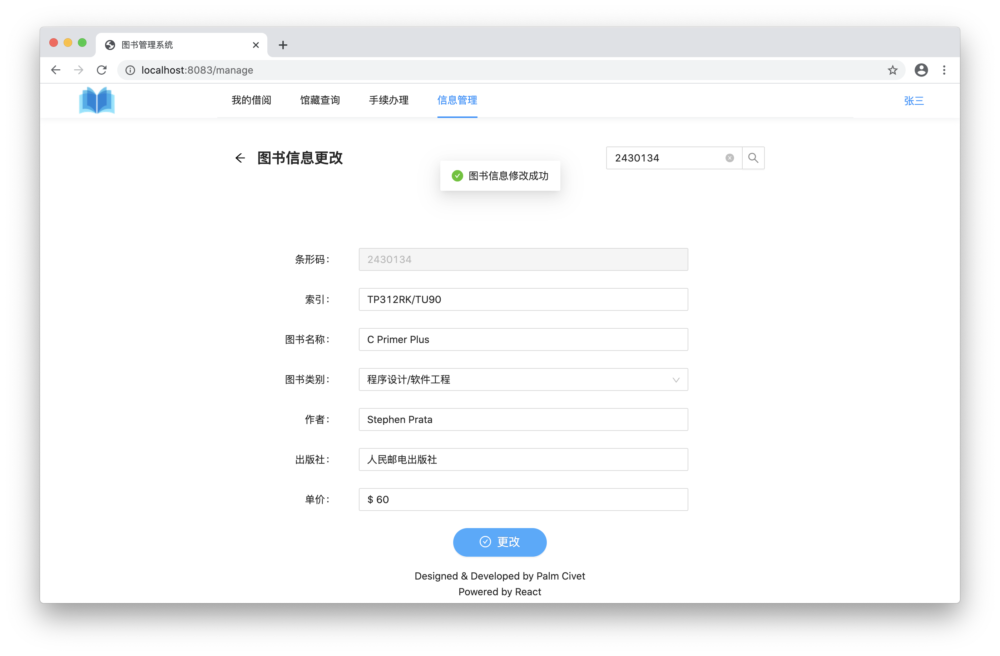
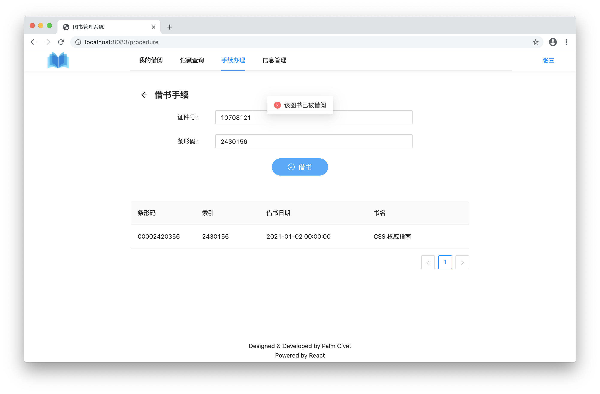

- [截图](#截图)
- [技术栈](#技术栈)
- [部署](#部署)
    - [前端](#前端)
    - [后端](#后端)
- [接口](#接口)

> 没有 ASP 的 ASP.NET 练习项目

## 截图













## 技术栈

- TypeScript
- MariaDB
- 前端
    - React
    - MobX
    - Webpack
    - Less
- 后端
    - Koa
    - Rollup

## 部署

```bash
$ git clone --depth=1 https://github.com/Palmcivet/weak-library.git
$ cd weak-library
```

### 前端

```bash
$ cd client
$ yarn
$ yarn pro:build
```

### 后端

```bash
$ cd server
$ yarn pro:start
```

## 接口

见 [接口文档](docs/interface.md)
